# 📊 Store Rating Application

A full-stack web application that allows users to rate stores on a scale of **1 to 5**. The system provides **role-based access** for administrators, normal users, and store owners with different functionalities.  

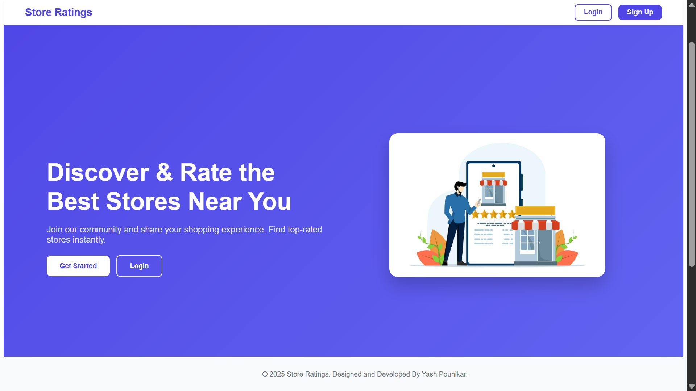
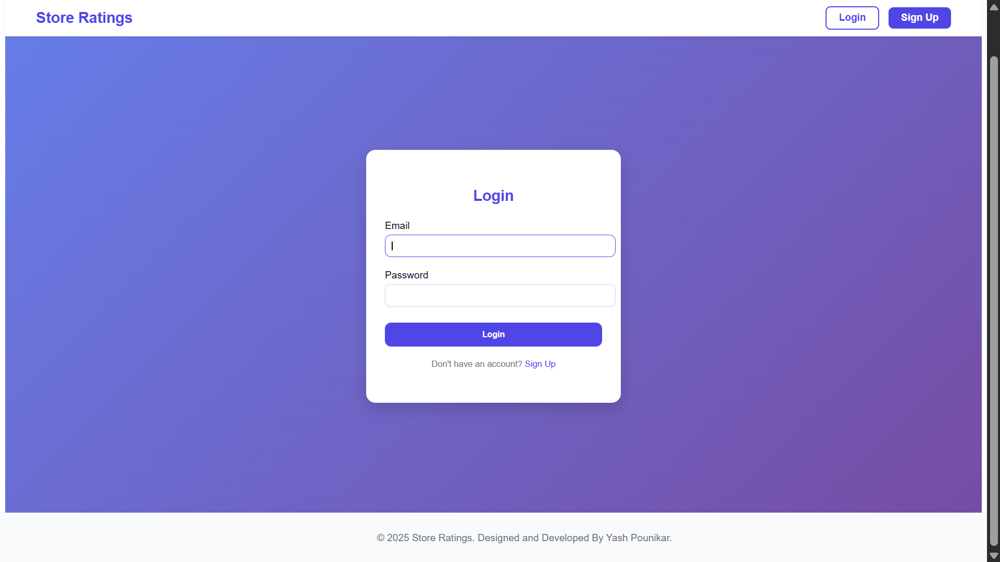

---

## 🚀 Tech Stack

- **Frontend:** React.js  
- **Backend:** Express.js (Node.js)  
- **Database:** MySQL  

---

## 📌 Features & User Roles

### 👨‍💻 System Administrator
- Add new stores, normal users, and admin users.  
- Dashboard with:
  - Total number of users  
  - Total number of stores  
  - Total number of ratings  
- Manage users:
  - Name, Email, Password, Address, Role  
- Manage stores:
  - Name, Email, Address, Rating  
- View detailed user info (including store ratings for owners).  
- Apply filters (Name, Email, Address, Role).  
- Logout functionality.  
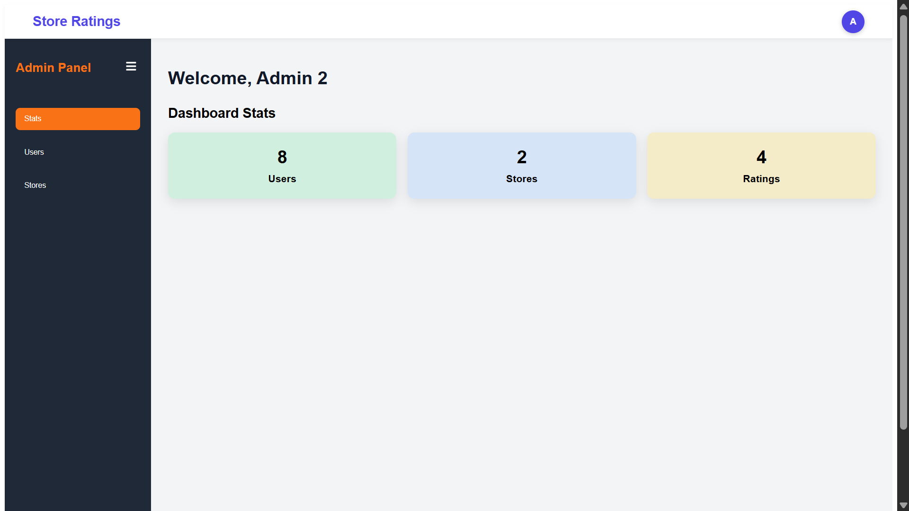
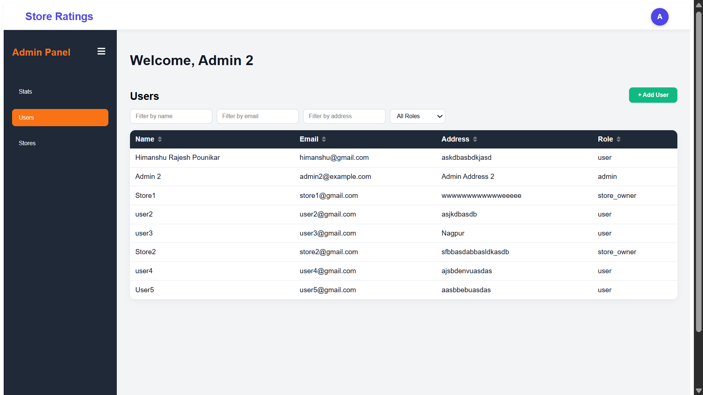
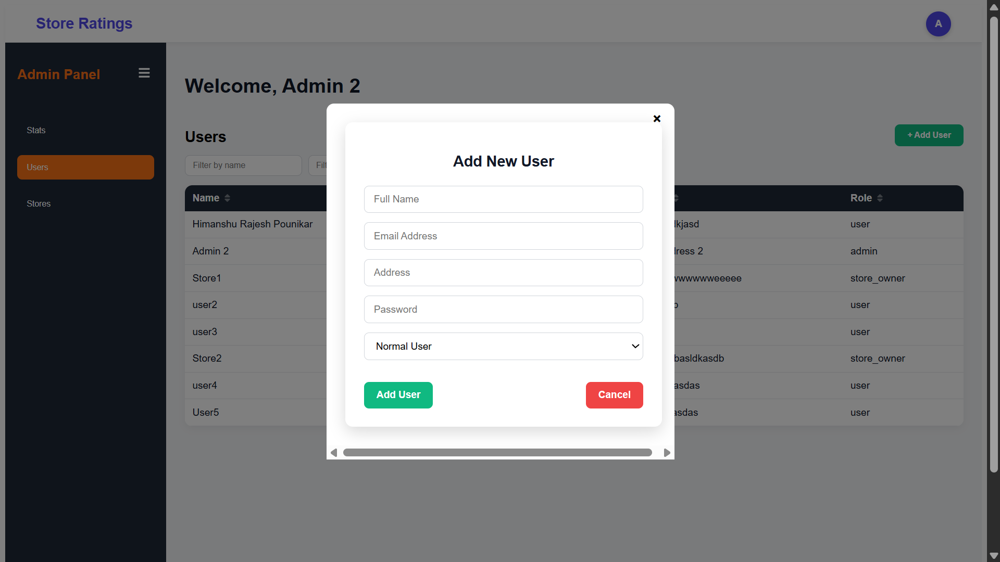
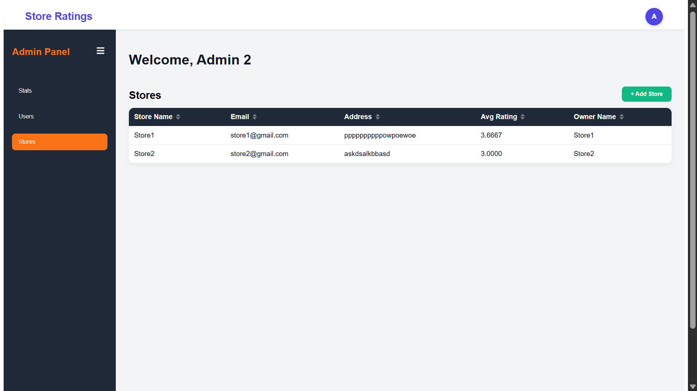
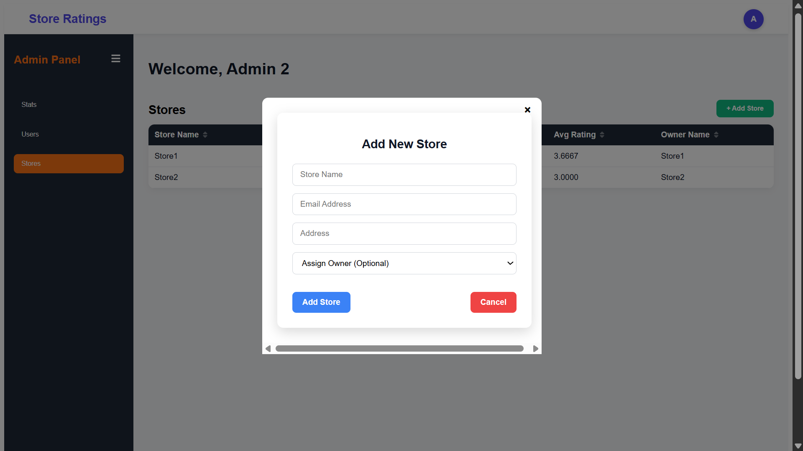


---

### 🙍 Normal User
- Register & login.  
- Update password after login.  
- Browse stores (with search by Name/Address).  
- Store listings show:
  - Store Name  
  - Address  
  - Overall Rating  
  - User’s submitted rating  
- Submit ratings (1–5).  
- Modify submitted ratings.  
- Logout functionality.  
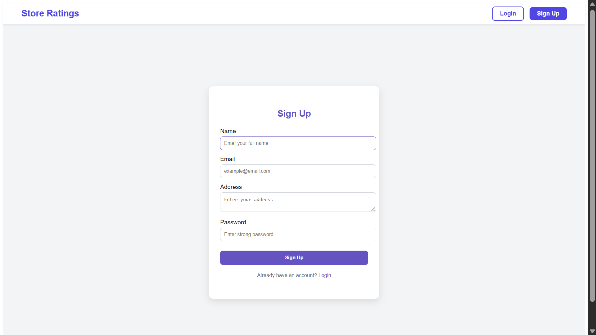
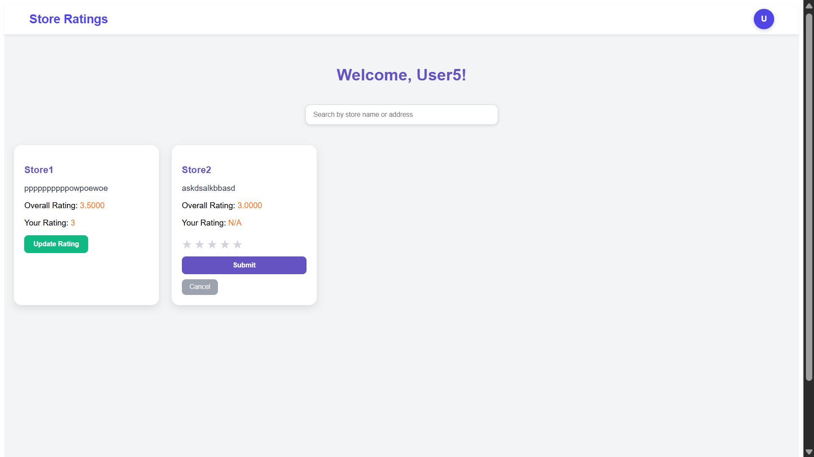
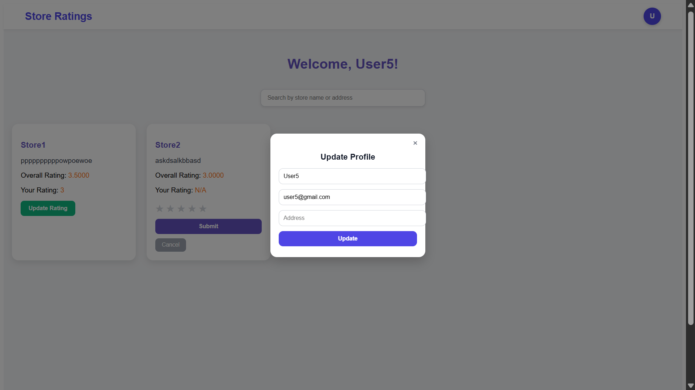
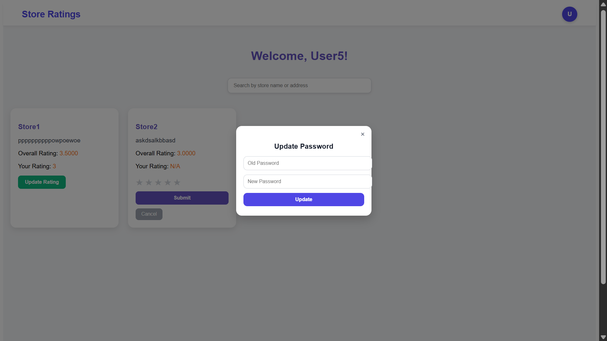


---

### 🏪 Store Owner
- Login & password update.  
- Dashboard with:
  - List of users who rated their store  
  - Average rating of their store  
- Logout functionality.  
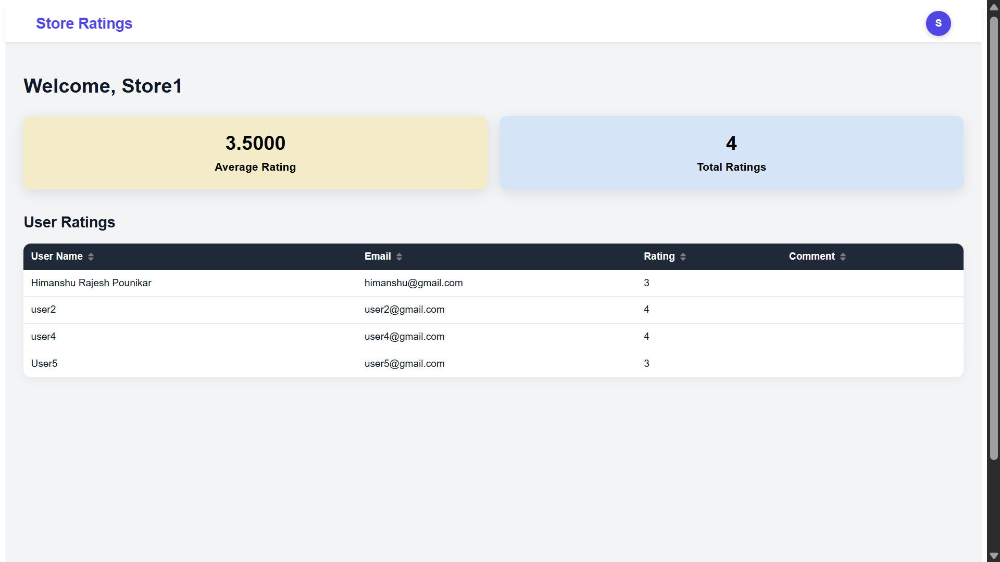
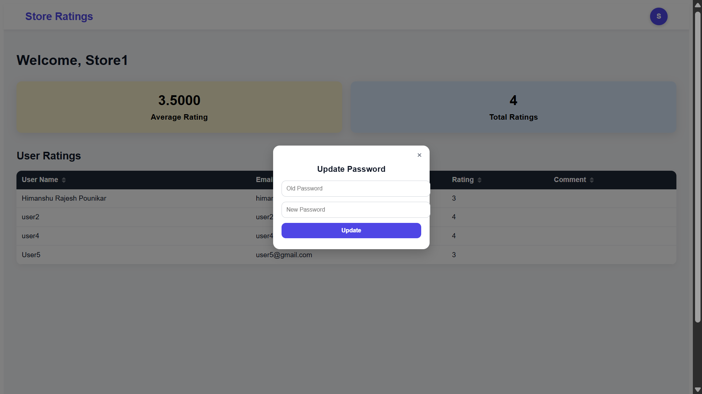

---

## 📝 Form Validations
- **Name**: Min 20 chars, Max 60 chars.  
- **Address**: Max 400 chars.  
- **Password**: 8–16 chars, must include 1 uppercase & 1 special character.  
- **Email**: Standard email format.  

---

## ⚙️ Installation & Setup

### 1️⃣ Clone the repository
```bash
git clone https://github.com/yashpounikar01/Store_Rating_Application.git
cd Store_Rating_Application
```

### 2️⃣ Backend Setup
```bash
cd backend
npm install
```

### Database Configuration
Edit `config/db.js` and update with your database credentials:

```js
const pool = mysql.createPool({
  host: "localhost",   // Change if DB is hosted elsewhere
  user: "root",        // Your MySQL username
  password: "yourpassword", // Your MySQL password
  database: "store_db" // Your database name
});


Run the backend server:
```bash
npm start
```

---

### 3️⃣ Frontend Setup
```bash
cd frontend
npm install
npm start
```

Frontend runs on **http://localhost:3000**  
Backend runs on **http://localhost:5000** (or your configured port).  

---

## 🗄️ Database Setup

Run the following in MySQL:

```sql
CREATE DATABASE store_db;
USE store_db;
```

### Users Table
```sql
CREATE TABLE users (
  id INT AUTO_INCREMENT PRIMARY KEY,
  name VARCHAR(60) NOT NULL,
  email VARCHAR(255) NOT NULL UNIQUE,
  password VARCHAR(255) NOT NULL,
  address VARCHAR(400),
  role ENUM('admin','user','store_owner') NOT NULL DEFAULT 'user',
  created_at TIMESTAMP DEFAULT CURRENT_TIMESTAMP,
  updated_at TIMESTAMP DEFAULT CURRENT_TIMESTAMP ON UPDATE CURRENT_TIMESTAMP
);
```

### Stores Table
```sql
CREATE TABLE stores (
  id INT AUTO_INCREMENT PRIMARY KEY,
  name VARCHAR(60) NOT NULL,
  email VARCHAR(255) UNIQUE,
  address VARCHAR(400),
  owner_id INT UNIQUE,
  created_at TIMESTAMP DEFAULT CURRENT_TIMESTAMP,
  updated_at TIMESTAMP DEFAULT CURRENT_TIMESTAMP ON UPDATE CURRENT_TIMESTAMP
);
```

### Ratings Table
```sql
CREATE TABLE ratings (
  id INT AUTO_INCREMENT PRIMARY KEY,
  user_id INT NOT NULL,
  store_id INT NOT NULL,
  rating INT NOT NULL,
  comment VARCHAR(255),
  created_at TIMESTAMP DEFAULT CURRENT_TIMESTAMP,
  updated_at TIMESTAMP DEFAULT CURRENT_TIMESTAMP ON UPDATE CURRENT_TIMESTAMP,
  FOREIGN KEY (user_id) REFERENCES users(id),
  FOREIGN KEY (store_id) REFERENCES stores(id)
);
```

---

## 🔑 Usage Examples
- **Normal User**: Sign up → Login → Browse stores → Rate store → Update rating.  
- **Admin**: Login → Add store & users → View dashboard → Apply filters.  
- **Store Owner**: Login → View store ratings & users → Check average rating.  

---

## 📊 Additional Notes
- Sorting supported on Name, Email, Address, Role fields.  
- Frontend & backend follow best practices.  
- Database schema designed with normalization & indexing in mind.  

---

## 🤝 Contributing
1. Fork the repo  
2. Create a new branch (`feature/my-feature`)  
3. Commit your changes (`git commit -m "Add my feature"`)  
4. Push to the branch (`git push origin feature/my-feature`)  
5. Open a Pull Request  

---

## 📜 License
This project is for educational & internship purposes. You can adapt and reuse it under your own license.  
